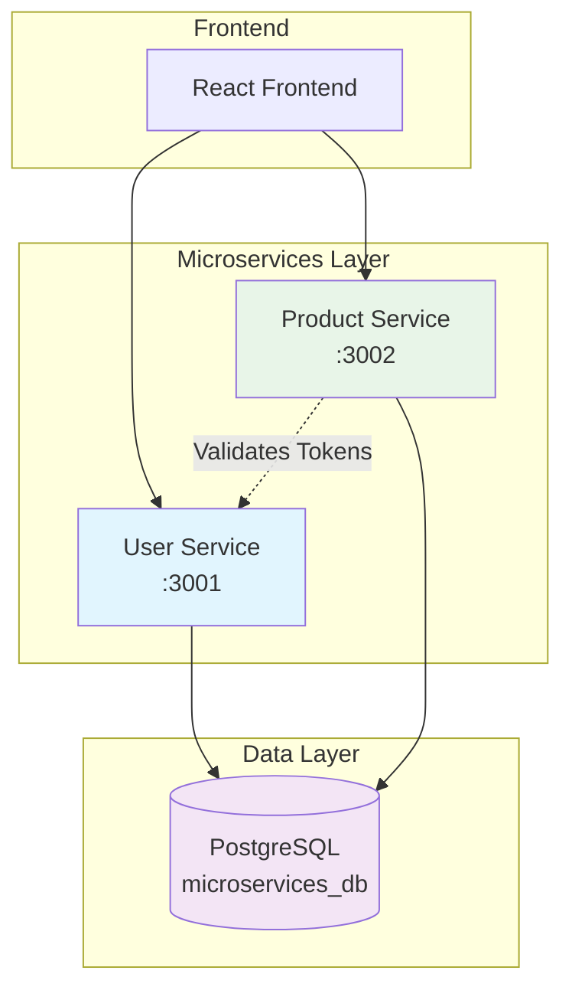
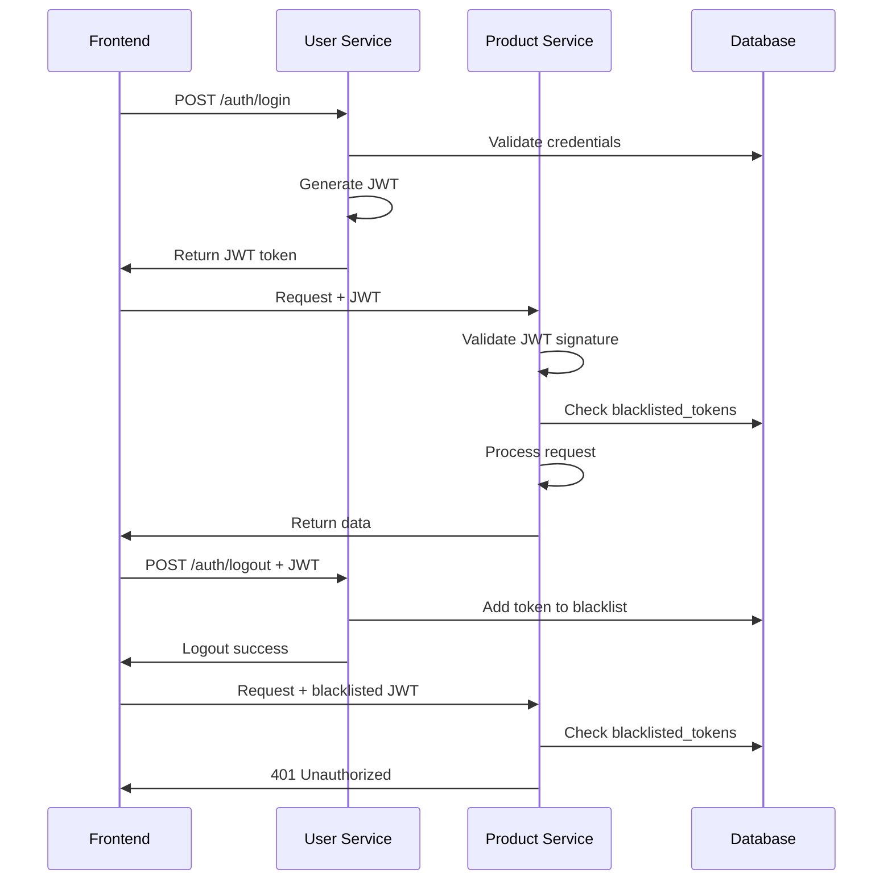
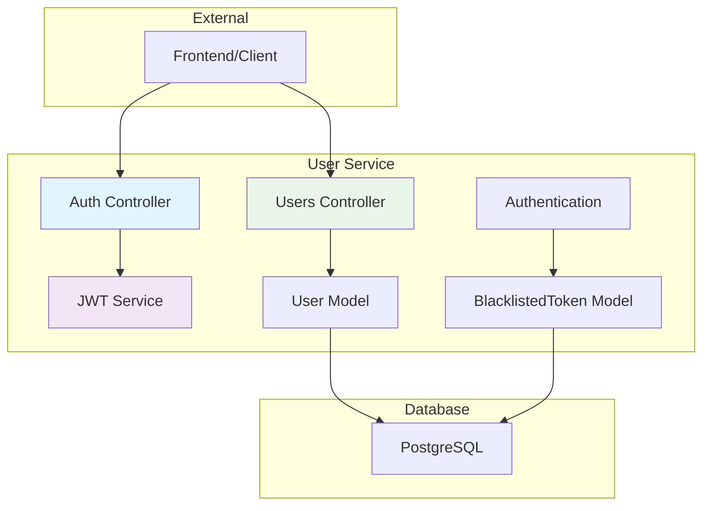

# Microservices Architecture - User Services

## 🏗️ System Architecture



## 🔄 Authentication Flow



---

# User Service

## 📋 Overview
The User Service is a Rails API microservice responsible for user authentication, registration, and management. It handles JWT token generation, user CRUD operations, and secure logout functionality.

## 🏗️ Architecture



## 🚀 Features

- ✅ **User Registration** - Create new user accounts
- ✅ **JWT Authentication** - Secure login with token generation
- ✅ **User Management** - Full CRUD operations for users
- ✅ **Secure Logout** - Token blacklisting system
- ✅ **Token Expiration** - Automatic 1-hour token expiry

## 📁 Project Structure

```
user-service/
├── app/
│   ├── controllers/
│   │   ├── authentication_controller.rb
│   │   ├── users_controller.rb
│   │   └── health_controller.rb
│   ├── models/
│   │   ├── user.rb
│   │   └── blacklisted_token.rb
│   └── services/
│       └── jwt_service.rb
├── config/
│   ├── database.yml
│   └── routes.rb
└── db/
    └── schema.rb
```

## 🔧 API Endpoints

| Method | Endpoint | Description | Authentication |
|--------|----------|-------------|----------------|
| POST | `/auth/register` | Register new user | No |
| POST | `/auth/login` | User login | No |
| POST | `/auth/logout` | User logout | Yes |
| GET | `/auth/me` | Get current user | Yes |
| GET | `/users` | List all users | Yes |
| GET | `/users/:id` | Get specific user | Yes |
| PUT | `/users/:id` | Update user | Yes |
| DELETE | `/users/:id` | Delete user | Yes |
| GET | `/health` | Service health check | No |

## 🛠️ Installation & Setup

### Prerequisites
- Ruby 3.0+
- Rails 8.0+
- PostgreSQL

### Installation Steps
```bash
# Clone and setup
git clone <repository>
cd user-service

# Install dependencies
bundle install

# Setup database
rails db:create
rails db:migrate
rails db:seed

# Set JWT secret
echo "JWT_SECRET_KEY=$(openssl rand -hex 128)" > .env

# Start server
rails server -p 3001
```

## Setting Up Credentials
```bash
# Edit credentials (requires master key)
EDITOR="code --wait" rails credentials:edit
```

### Add to credentials.yml.enc:
```yaml
database:
  database: microservices_db
  username: your_username
  password: your_password

jwt_secret: your_secure_jwt_secret_key_here
```

## 🧪 Testing

```bash
# Test registration
curl -X POST http://localhost:3001/auth/register \
  -H "Content-Type: application/json" \
  -d '{
    "email": "user@example.com",
    "password": "password123",
    "first_name": "John",
    "last_name": "Doe"
  }'

# Test login
curl -X POST http://localhost:3001/auth/login \
  -H "Content-Type: application/json" \
  -d '{
    "email": "user@example.com",
    "password": "password123"
  }'
```

## 📊 Database Schema

```sql
CREATE TABLE users (
  id SERIAL PRIMARY KEY,
  email VARCHAR(255) UNIQUE NOT NULL,
  password_digest VARCHAR(255) NOT NULL,
  first_name VARCHAR(100),
  last_name VARCHAR(100),
  created_at TIMESTAMP DEFAULT CURRENT_TIMESTAMP,
  updated_at TIMESTAMP DEFAULT CURRENT_TIMESTAMP
);

CREATE TABLE blacklisted_tokens (
  id SERIAL PRIMARY KEY,
  jti VARCHAR(255) UNIQUE NOT NULL,
  exp TIMESTAMP NOT NULL,
  user_id INTEGER NOT NULL,
  created_at TIMESTAMP DEFAULT CURRENT_TIMESTAMP,
  updated_at TIMESTAMP DEFAULT CURRENT_TIMESTAMP
);
```

---
